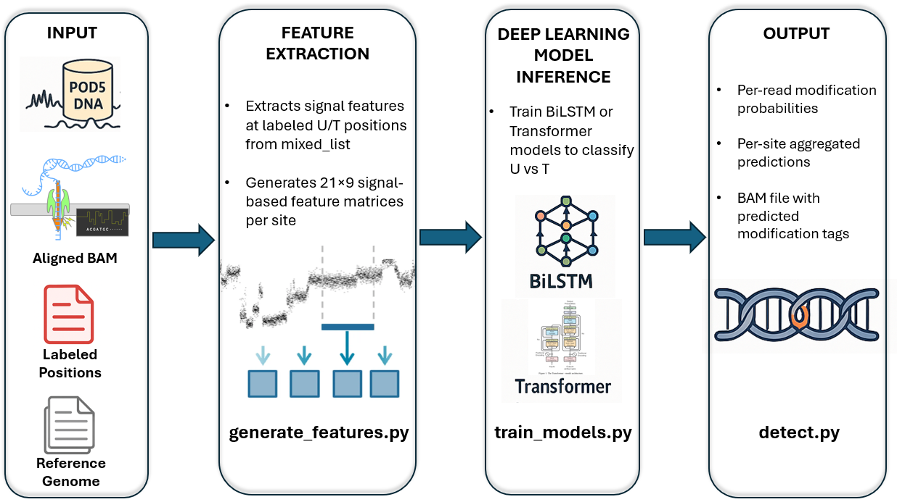

# CUNA
CUNA (Cytosine Uracil Neural Algorithm) is a deep learning-based pipeline for detecting cytosine deamination events (C→U) in ancient DNA sequenced with Oxford Nanopore technology. It extends the [DeepMod2](https://github.com/WGLab/DeepMod2) framework by introducing preprocessing steps for signal simulation and modification, and supports training and inference using BiLSTM and Transformer models.

This pipeline is specifically designed for studying ancient DNA samples, where cytosines often spontaneously deaminate to uracils due to age-related chemical damage.

<p align="center">
  
</p>

## Project Structure
```
CUNA/
├── simulate_scripts/
│ ├── dna.pod5
│ ├── rna.pod5
│ ├── bam_files/
│     └── rna.bam
│     └── dna.bam
│     └── dna_sorted.bam
│     └── dna_sorted.bam.bai
│ ├── simulate_deamination_signals.py
│ ├── simulate_deamination_signals_verif.py
│ ├── output/
│     └── mixed_list
│     └── deamination.pod5
│     └── log.txt
├── train_models/
│ ├── generate_features.py
│ ├── train_models.py
│ ├── utils.py
│ ├── data/
|     └── genome_fasta.fa
│     └── genome_fasta.fai
│     └── bam_files/
|         └── dna.bam
│     └── raw_data/
|         └── signal_files/
|             └── deamination.pod5
│         └── label_files/
|             └── mixed_list
│ ├── features_output/
│     └── args
│     └── output.features.X.npz
│ ├── train_output/
│     └── bilstm/
│     └── transformer/
│     └── args
│     └── model.log
├── test/
│ ├── data/
│     └── new.pod5
│     └── new.bam
│ ├── utils.py
│ ├── detect.py
│ ├── test_output/
│     └── output.bam
│     └── output.per_read
│     └── output.per_site
│     └── args
```

---

## Environment Setup

We recommend using [Micromamba](https://mamba.readthedocs.io/en/latest/user_guide/micromamba.html) for environment isolation.

```bash
micromamba create -n cuna_env -f requirements.yml
micromamba activate cuna_env
```

##   Download Software Packges

```bash
# Install CUNA
git clone https://github.com/iris1901/CUNA.git ${INPUT_DIR}/CUNA
```
Download the basecaller for your platform (macOS, Linux...):

```bash
# For Linux:
wget -qO- https://cdn.oxfordnanoportal.com/software/analysis/dorado-0.5.3-linux-x64.tar.gz | tar xzf - -C ${INPUT_DIR}
${INPUT_DIR}/dorado-0.5.3-linux-x64/bin/dorado download --model  dna_r10.4.1_e8.2_400bps_hac@v4.3.0 --directory ${INPUT_DIR}/dorado-0.5.3-linux-x64/models/
${INPUT_DIR}/dorado-0.5.3-linux-x64/bin/dorado download --model  rna004_130bps_hac@v5.2.0 --directory ${INPUT_DIR}/dorado-0.5.3-linux-x64/models/

# For macOS (Apple Silicon):
wget -qO- https://cdn.oxfordnanoportal.com/software/analysis/dorado-0.5.3-osx-arm64.tar.gz | tar xzf - -C ${INPUT_DIR}
${INPUT_DIR}/dorado-0.5.3-osx-arm64/bin/dorado download --model dna_r10.4.1_e8.2_400bps_hac@v4.3.0 --directory ${INPUT_DIR}/dorado-0.5.3-osx-arm64/models/
${INPUT_DIR}/dorado-0.5.3-osx-arm64/bin/dorado download --model rna004_130bps_hac@v5.2.0 --directory ${INPUT_DIR}/dorado-0.5.3-osx-arm64/models/
```

## Step 0: Basecalling and Alignment (DNA + RNA)

To begin, we perform basecalling on two raw signal datasets:

- A DNA POD5 file generated from DeepMod2 of modern DNA using an R10.4.1 flow cell.
- An RNA BLOW5 file publicly available from nanoCEM (https://github.com/lrslab/nanoCEM/tree/3f7ab5f001448e4f15ef5d17dad04ca6507394bb/example/data/wt/file.blow5), which we converted to POD5 for compatibility.

We then use Dorado for basecalling, with --emit-moves to obtain alignment between signal and sequence.

```bash
# DNA POD5
wget -qO- https://github.com/WGLab/DeepMod2/files/14368872/sample.pod5.tar.gz| tar xzf - -C ${INPUT_DIR}/nanopore_raw_data

# RNA BLOW5
wget https://github.com/lrslab/nanoCEM/raw/3f7ab5f001448e4f15ef5d17dad04ca6507394bb/example/data/wt/file.blow5 \
  -O ${INPUT_DIR}/pod5/rna.blow5

# Convert BLOW5 to POD5
pip install blue-crab
blue-crab s2p rna.blow5 -o rna.pod5

# Genome Reference (for DNA only)
# Before DNA basecalling, we must download a reference genome for anchored alignment:
wget ftp://ftp.ncbi.nlm.nih.gov/genomes/all/GCF/000/001/405/GCF_000001405.39_GRCh38.p13/GRCh38_major_release_seqs_for_alignment_pipelines/GCA_000001405.15_GRCh38_no_alt_plus_hs38d1_analysis_set.fna.gz -O -| gunzip -c > ${INPUT_DIR}/GRCh38.fa
wget ftp://ftp.ncbi.nlm.nih.gov/genomes/all/GCF/000/001/405/GCF_000001405.39_GRCh38.p13/GRCh38_major_release_seqs_for_alignment_pipelines/GCA_000001405.15_GRCh38_no_alt_plus_hs38d1_analysis_set.fna.fai -O ${INPUT_DIR}/GRCh38.fa.fai

samtools faidx ${INPUT_DIR}/genome_fasta.fa
```

RNA reads are basecalled without alignment, using the Dorado RNA model:
```bash
${INPUT_DIR}/dorado-0.5.3-linux-x64/bin/dorado basecaller \
  --model rna004_130bps_hac@v5.2.0 \
  --emit-moves \
  ${INPUT_DIR}/pod5/rna.pod5 > ${OUTPUT_DIR}/bam/rna.bam
```
For DNA, we perform reference-anchored basecalling and alignment:
```bash
${INPUT_DIR}/dorado-0.5.3-linux-x64/bin/dorado basecaller \
  --model dna_r10.4.1_e8.2_400bps_hac@v4.3.0 \
  --emit-moves \
  --reference ${INPUT_DIR}/fasta/genome.fa \
  ${INPUT_DIR}/pod5/dna.pod5 > ${OUTPUT_DIR}/bam/dna.bam
```

## Step 1: Simulate Ancient DNA from POD5

Before simulating uracil insertions, you can explore the characteristics of the raw signals in the DNA and RNA POD5 files. This helps validate signal consistency and understand nucleotide-specific patterns prior to resampling or insertion.

We use a helper script (estatistics.py) that extracts base-level statistics from both DNA and RNA sources, and generates a CSV summary.

```bash
python estatistics.py \
  --pod5_dna ${INPUT_DIR}/pod5/dna.pod5 \
  --bam_dna ${INPUT_DIR}/bam/dna.bam \
  --pod5_rna ${INPUT_DIR}/pod5/rna.pod5 \
  --bam_rna ${INPUT_DIR}/bam/rna.bam \
  --output ${OUTPUT_DIR}/estatistics.csv
```

Since no real ancient DNA POD5 is available, we **simulate uracil-induced damage** by:

- Extracting U signals from RNA POD5.
- Inserting those signals in place of cytosines in DNA POD5 at randomly chosen sites.
- Respecting empirical estimates of deamination rates (~3–10% C→U).
- Maintaining total signal length to preserve BAM compatibility.
- Generating a corresponding `mixed_list.txt` with modified and unmodified positions.

### Example Command

```bash
python simulate_deamination_signals.py   --pod5_dna /Users/iris/Desktop/transf_U_to_C/DNA_can.pod5   --bam_dna /Users/iris/Desktop/transf_U_to_C/bam_files/DNA.bam   --pod5_rna /Users/iris/Desktop/transf_U_to_C/RNA.pod5   --bam_rna /Users/iris/Desktop/transf_U_to_C/bam_files/RNA.bam
```
(Optional) To ensure that uracil signals were inserted correctly and signal lengths were preserved, you can use an alternative version of the simulation script that includes automatic verification steps

```bash
python simulate_deamination_signals_verif.py \
  --dna_pod5 ${INPUT_DIR}/pod5/dna.pod5 \
  --rna_pod5 ${INPUT_DIR}/pod5/rna.pod5 \
  --dna_bam ${INPUT_DIR}/bam/dna.bam \
  --rna_bam ${INPUT_DIR}/bam/rna.bam \
  --output_dir ${OUTPUT_DIR} \
  --log ${OUTPUT_DIR}/logs/log.txt
```

We will generate:

A new POD5 file that simulates cytosine deamination events (C→U) typically found in ancient DNA, by replacing the signal at selected cytosine sites with uracil signals extracted from RNA,
A mixed_list.txt file that includes: the genomic positions where uracils have been inserted (label 1), and a set of real thymine positions found in the original DNA data (label 0), used as unmodified controls.
These outputs are used directly in Step 2.

## Step 2: Generate Training Features
Once we have simulated cytosine deaminations (C→U) and produced the corresponding mixed_list.txt, we extract features from the modified signals using the adapted DeepMod2 script generate_features.py.

This step generates a dataset of numerical features representing the raw signal and sequence context around each position of interest (both uracils and true thymines). These features will later be used to train a deep learning model capable of distinguishing deaminated C→U sites from natural T bases.

```bash
python ${INPUT_DIR}/DeepMod2/train/generate_features.py \
  --bam ${INPUT_DIR}/bam/all_reads.bam \
  --input ${INPUT_DIR}/pod5/dna_with_U_signals.pod5 \
  --ref ${INPUT_DIR}/fasta/genome.fa \
  --file_type pod5 \
  --threads 4 \
  --output ${OUTPUT_DIR}/features/mixed/ \
  --pos_list ${INPUT_DIR}/mixed_lists/mixed_list.txt \
  --window 10 \
  --seq_type dna
```
The output folder will contain .npz files with the extracted features and labels. These files are ready to be used in model training (see Step 3).

## Step 3: Model Training (BiLSTM and Transformer)

In this step, we train neural networks to detect cytosine deamination (C→U) events using the features generated in Step 2. The training is performed using the train_models.py script, which supports two architectures:

- BiLSTM (Bidirectional Long Short-Term Memory) – a recurrent model suitable for capturing temporal dependencies in the signal,
- Transformer – an attention-based model better suited for learning long-range interactions in both signal and sequence context.

Both models take as input:
- the one-hot encoded sequence context (±10 bases),
- the resampled raw signal window,
- the binary label (1 = uracil, 0 = thymine).

They are trained to output a modification probability for each sample.

```bash
python ${INPUT_DIR}/DeepMod2/train/train_models.py \
  --mixed_training_dataset ${OUTPUT_DIR}/features/mixed/ \
  --validation_type split \
  --validation_fraction 0.2 \
  --model_save_path ${OUTPUT_DIR}/models/mixed_bilstm \
  --model_type bilstm \
  --embedding_type one_hot \
  --num_layers 2 \
  --num_fc 128 \
  --fc_type middle \
  --dim_feedforward 256 \
  --embedding_dim 16 \
  --epochs 40 \
  --batch_size 512 \
  --lr 0.0005 \
  --l2_coef 0.0001 \
  --weights auto \
  --seed 0
```
```bash
python ${INPUT_DIR}/DeepMod2/train/train_models.py \
  --mixed_training_dataset ${OUTPUT_DIR}/features/mixed/ \
  --validation_type split \
  --validation_fraction 0.1 \
  --model_save_path ${OUTPUT_DIR}/models/mixed_transformer \
  --model_type transformer \
  --embedding_type one_hot \
  --num_layers 2 \
  --dim_feedforward 256 \
  --num_fc 128 \
  --fc_type middle \
  --embedding_dim 16 \
  --pe_dim 16 \
  --pe_type fixed \
  --nhead 4 \
  --epochs 40 \
  --batch_size 512 \
  --lr 0.0002 \
  --l2_coef 0.001 \
  --weights auto \
  --seed 0
```
Each model training run produces:
- model.cfg: best checkpoint saved,
- model.epochX.pt
- args.txt: a record of all parameters used for reproducibility,
- model.log: epoch-by-epoch training and validation metrics,
- metrics : final performance metrics such as Accuracy, F1, AUROC, AUPRC, and MCC.

## Step 4: Modification Detection on Test Data

In this final step, we use the trained model to detect uracil modifications in a new DNA dataset

To prepare the BAM file used for detection, basecall the modified POD5 file without the --reference option:

```bash
${INPUT_DIR}/dorado-0.5.3-linux-x64/bin/dorado basecaller \
  --emit-moves \
  --model dna_r10.4.1_e8.2_400bps_hac@v4.3.0 \
  ${INPUT_DIR}/test/nuevo.pod5 > ${INPUT_DIR}/test/test.bam
```

The following command runs the detector on the test POD5 file using the trained model:

```bash
python ${INPUT_DIR}/DeepMod2/deepmod2.py detect \
  --model ${OUTPUT_DIR}/models/mixed_bilstm/model.cfg,${OUTPUT_DIR}/models/mixed_bilstm/model.epoch40.pt \
  --input ${INPUT_DIR}/test/partes_pod5/parte_01.pod5 \
  --bam ${INPUT_DIR}/test/test.bam \
  --output ${OUTPUT_DIR}/test/predictions/ \
  --motif T 0 \
  --mod_symbol U \
  --threads 4
```

The detection script generates:
- output.per_read: per-read predictions of modification probability
- output.per_site: per-site predictions of modification probability
- output.bam: BAM file annotated with uracil modification tags
- args.txt: record of the command and options used.

Each prediction corresponds to a T base in the BAM file. The model will estimate whether that T originated from a true thymine or a deaminated cytosine (uracil), based on the signal pattern and context.
The --motif T 0 argument tells the model to evaluate every T at position 0 of the window. The --mod_symbol U indicates that the predicted modification corresponds to uracil.


