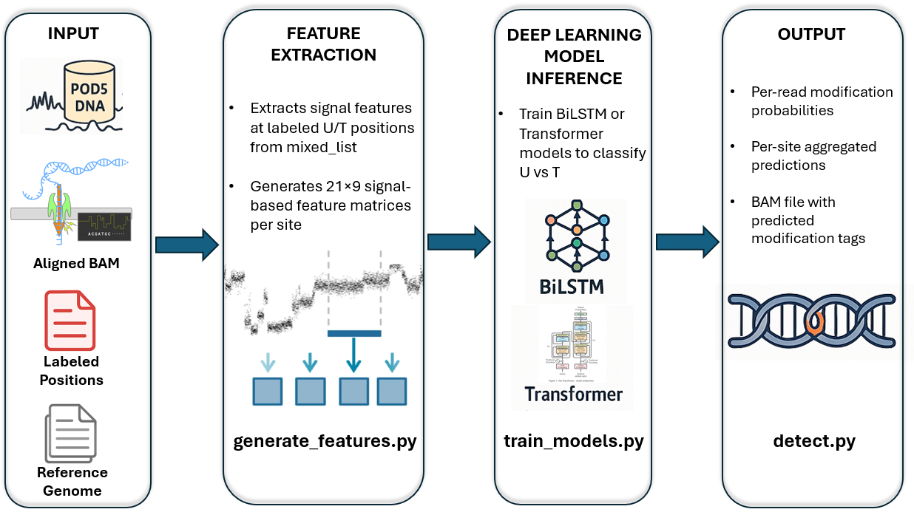

[](https://anaconda.org/bioconda/cuna)
[](https://anaconda.org/bioconda/cuna)
[](https://anaconda.org/bioconda/cuna)

# CUNA
CUNA (Cytosine Uracil Neural Algorithm) is a deep learning-based pipeline adapted from the [DeepMod2](https://github.com/WGLab/DeepMod2) framework for detecting cytosine deamination events in ancient DNA sequenced with Oxford Nanopore Technologies.

This pipeline is specifically designed for studying ancient DNA samples, where cytosines often spontaneously deaminate to uracils due to age-related chemical damage.

<p align="center">
  
</p>

**Note:** All input data used in this pipeline—including the `deamination.pod5` file, the `mixed_list.txt` annotations, and the exploratory signal analyses (boxplots, PCA, LDA)—were generated in the companion repository [aDNA-simulation](https://github.com/iris1901/aDNA-simulation).


## Project Structure
```
CUNA/
├── LICENSE
├── README.md
├── setup.py
├── cuna/
│ ├── CUNA.py
│ ├── data/
|     └── train_data/
|           └── dna.bam
|           └── deamination.pod5
|           └── mixed_list.txt
|           └── GRCh38.fa
|           └── GRCh38.fa.fai
|     └── test_data/
|           └── test.bam
|           └── test.pod5
│ ├── images/
|     └── deamination_pod5_figure.jpg
|     └── boxplot_features.jpg
|     └── violin_features.jpg
|     └── lda_features.jpg
|     └── pca_features.jpg
|     └── framework.jpg
│ ├── train/
|     └── generate_features.py
|     └── train_models.py
|     └── utils.py
│ ├── src/
|     └── utils.py
|     └── detect.py
|     └── models.py
│ ├── output/
│     └── features_output/
│           └── args
│           └── output.features.X.npz
│     └── train_output/
│           └── bilstm/
│           └── transformer/
│           └── args
│           └── model.log
│     └── test_output/
│           └── output.bam
│           └── output.per_read
│           └── output.per_site
│           └── args
├── recipes/
│ ├── cuna/
|     └── meta.yaml
├── config.yml
```

## Environment Setup

We recommend using [Micromamba](https://mamba.readthedocs.io/en/latest/user_guide/micromamba.html) to create a isolated environment, ensuring full reproducibility of dependencies across platforms.

Follow these steps to set up the environment and install cuna.

```bash
micromamba create -n CUNA -c conda-forge -c bioconda cuna
micromamba activate CUNA
```

If you wish to inspect the source code, access the example scripts, or use the dataset that was employed to train and evaluate the models, you can clone the repository with:
```bash
git clone https://github.com/iris1901/CUNA.git ${INPUT_DIR}/CUNA
# This will generate the necessary `cuna.egg-info/` metadata folder
cd path/to/CUNA
pip install -e .
```

##   Download Software Packges

In this project, we use [Dorado](https://github.com/nanoporetech/dorado.git), the official basecaller from Oxford Nanopore Technologies, to perform signal-to-sequence conversion for DNA datasets.
We will download the Dorado basecaller (v0.9.1) along with the appropriate pre-trained basecalling models for each data type and flow cells.
Installation instructions for both Linux and macOS (Apple Silicon) are provided below.

```bash
# For Linux:
wget -qO- https://cdn.oxfordnanoportal.com/software/analysis/dorado-0.9.1-linux-x64.tar.gz | tar xzf - -C ${INPUT_DIR}
${INPUT_DIR}/dorado-0.9.1-linux-x64/bin/dorado download --model  dna_r10.4.1_e8.2_400bps_hac@v4.3.0 --directory ${INPUT_DIR}/dorado-0.9.1-linux-x64/models/

# For macOS (Apple Silicon):
wget -qO- https://cdn.oxfordnanoportal.com/software/analysis/dorado-0.9.1-osx-arm64.tar.gz | tar xzf - -C ${INPUT_DIR}
${INPUT_DIR}/dorado-0.9.1-osx-arm64/bin/dorado download --model dna_r10.4.1_e8.2_400bps_hac@v4.3.0 --directory ${INPUT_DIR}/dorado-0.9.1-osx-arm64/models/
```

It is necessary to download a reference genome for anchored alignment. 
These commands will download and decompress the GRCh38 reference genome and its index into the appropriate directory used during model training and alignment.
```bash
# Genome Reference (for DNA only)
wget ftp://ftp.ncbi.nlm.nih.gov/genomes/all/GCF/000/001/405/GCF_000001405.39_GRCh38.p13/GRCh38_major_release_seqs_for_alignment_pipelines/GCA_000001405.15_GRCh38_no_alt_plus_hs38d1_analysis_set.fna.gz -O -| gunzip -c > ${INPUT_DIR}/CUNA/cuna/data/train_data/GRCh38.fa
wget ftp://ftp.ncbi.nlm.nih.gov/genomes/all/GCF/000/001/405/GCF_000001405.39_GRCh38.p13/GRCh38_major_release_seqs_for_alignment_pipelines/GCA_000001405.15_GRCh38_no_alt_plus_hs38d1_analysis_set.fna.fai -O ${INPUT_DIR}/CUNA/cuna/data/train_data/GRCh38.fa.fai
```

## Step 1: Generate Training Features
We extract features from the modified signals using the script `generate_features.py`. We will generate features for the sample by providing signal POD5 file as --input, BAM file as --bam and a list of positions with modified/unmodified labels as --pos_list and use --threads NUM_THREADS to speed up feature generation. 

In this case, we will use a window size of 10, which means how many bases before and after each base position of interest, from pos_list, to include in feature generation. These features will later be used to train a binary classifier, deep learning model, capable of distinguishing U from T bases.

```bash
cuna features \
  --bam ${INPUT_DIR}/CUNA/cuna/data/train_data/dna.bam \
  --input ${INPUT_DIR}/CUNA/cuna/data/train_data/deamination.pod5 \
  --ref ${INPUT_DIR}/CUNA/cuna/data/train_data/GRCh38.fa \
  --file_type pod5 \
  --threads 4 \
  --output ${INPUT_DIR}/CUNA/cuna/output/features_output/ \
  --pos_list ${INPUT_DIR}/CUNA/cuna/data/train_data/mixed_list \
  --window 10 \
  --seq_type dna
```
The output folder will contain .npz files with the extracted features and labels. These files are ready to be used in model training.

## Step 2: Model Training (BiLSTM and Transformer)

In this step, we train neural networks to detect cytosine deamination events using the features generated in Step 2. The training is performed using the `train_models.py` script, which supports two architectures:

- BiLSTM (Bidirectional Long Short-Term Memory) – a recurrent model suitable for capturing temporal dependencies in the signal
- Transformer – an attention-based model better suited for learning long-range interactions in both signal and sequence context

Both models take as input the one-hot encoded sequence context (±10 bases), the resampled raw signal window and the binary label (1 = uracil, 0 = thymine).

You can find a full list of options using --help command. In this demo we will train:

For bilstm training.
```bash
cuna train \
  --mixed_training_dataset ${INPUT_DIR}/CUNA/cuna/output/features_output/ \
  --validation_type split \
  --validation_fraction 0.2 \
  --model_save_path ${INPUT_DIR}/CUNA/cuna/output/train_output/bilstm \
  --model_type bilstm \
  --embedding_type one_hot \
  --num_layers 2 \
  --num_fc 128 \
  --fc_type middle \
  --dim_feedforward 256 \
  --embedding_dim 16 \
  --epochs 40 \
  --batch_size 512 \
  --lr 0.0005 \
  --l2_coef 0.0001 \
  --weights auto \
  --seed 0
```

For transformer training.
```bash
cuna train \
  --mixed_training_dataset ${INPUT_DIR}/CUNA/cuna/output/features_output/ \
  --validation_type split \
  --validation_fraction 0.1 \
  --model_save_path ${INPUT_DIR}/CUNA/cuna/output/train_output/transformer \
  --model_type transformer \
  --embedding_type one_hot \
  --num_layers 2 \
  --dim_feedforward 256 \
  --num_fc 128 \
  --fc_type middle \
  --embedding_dim 16 \
  --pe_dim 16 \
  --pe_type fixed \
  --nhead 4 \
  --epochs 35 \
  --batch_size 512 \
  --lr 0.0002 \
  --l2_coef 0.001 \
  --weights auto \
  --seed 0
```
Each model training run produces:
- A long file `model.log`
- `model.epochX.pt` epoch-by-epoch training and validation metrics, X saved model checkpoints
- A model configuration file `model.cfg`
- A file `args.txt` record of all parameters used for reproducibility
- Metrics such as accuracy, F1, loss, recall, precision, AUROC, AUPRC and MCC.

When we want to use this model, we have to provide a saved checkpoint and the model configuration file to CUNA.

## Step 3: Modification Detection on Test Data

In this final step, we use the trained model to detect uracils in a new DNA dataset.

To prepare the BAM file used for detection, basecall a new modified POD5 file without the --reference option:

```bash
${INPUT_DIR}/dorado-0.9.1-linux-x64/bin/dorado basecaller \
  --emit-moves \
  --model dna_r10.4.1_e8.2_400bps_hac@v4.3.0 \
  ${INPUT_DIR}/CUNA/cuna/data/test_data/test.pod5 > ${INPUT_DIR}/CUNA/cuna/data/test_data/test.bam
```
We will now use the model `model.epoch40.pt` and `model.cfg` on the test dataset using CUNA's detect module. We will provide the model as --model PATH_TO_MODEL_CONFIGURATION_FILE,PATH_TO_MODEL_CHECKPOINT where we provide the paths to model configuration file and model checkpoint separated by a comma to --model parameter.

Each prediction corresponds to a T base in the BAM file. The model will estimate whether that T originated from a true thymine or a deaminated cytosine (uracil), based on the signal pattern and context.
The --motif T 0 argument tells the model to evaluate every T at position 0 of the window. The --mod_symbol U indicates that the predicted modification corresponds to uracil.

The following command runs the detector on the test POD5 file using the trained model.

```bash
cuna detect \
  --model ${INPUT_DIR}/CUNA/cuna/output/train_output/bilstm/model.cfg,${INPUT_DIR}/CUNA/cuna/output/train_output/bilstm/model.epoch40.pt \
  --input ${INPUT_DIR}/CUNA/cuna/data/test_data/test.pod5 \
  --bam ${INPUT_DIR}/CUNA/cuna/data/test_data/test.bam \
  --output ${INPUT_DIR}/CUNA/cuna/output/test_output/ \
  --motif T 0 \
  --mod_symbol U \
  --threads 4
```

The detection script generates:
- `output.per_read`: per-read predictions of modification probability
- `output.per_site`: per-site predictions of modification probability
- `output.bam`: BAM file annotated with uracil modification tags
- `args.txt`: record of the command and options used.

NOTE: All outputs presented in this repository —including performance metrics, model checkpoints, visualizations of signal distributions, and detection results— were generated using the exact configurations and commands provided throughout this README. This ensures complete reproducibility of the experiments.

## Acknowledgements

This project is based on [DeepMod2](https://github.com/WGLab/DeepMod2), developed by Wang Genomics Lab.

Parts of the code and training pipeline were adapted from the original DeepMod2 repository to support the simulation and detection of cytosine deamination events in ancient DNA.
